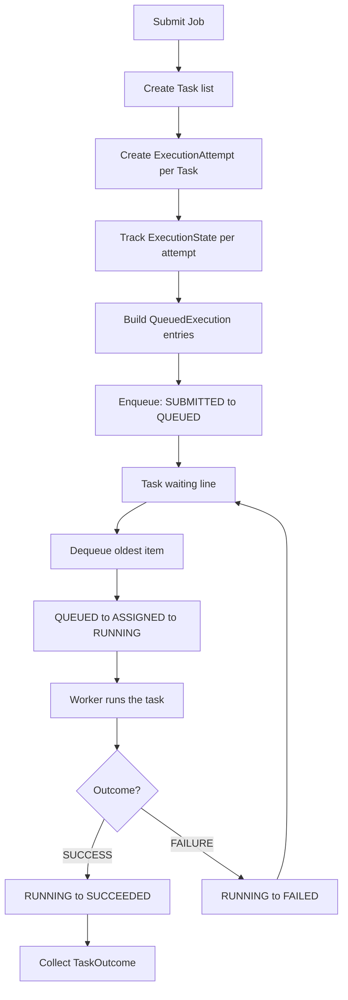

# Eve

A distributed batch-computing system for trusted local networks.

Eve lets you submit a batch of small jobs, runs each one safely, and reports back whether it worked. You describe *what* to run; Eve handles queuing, state tracking, execution, and structured results.

---

## What Eve does

Imagine you have several small computations to run — sum a range of numbers, echo some data, and so on. Instead of writing your own scheduling glue, you package them into a **Job**, hand it to Eve, and get back a **TaskOutcome** for each piece of work: either a return value on success, or a structured error on failure.

Eve is built in layers. Each layer lives in its own file under `src/eve/`. A **Coordinator** (implemented in `foundation.py`) wires those layers into one pipeline. The integration test in `tests/test_foundation.py` proves the whole story works end to end.

---

## The vocabulary, file by file

| File | What it provides | Role in Eve |
|------|------------------|-------------|
| [`src/eve/job.py`](src/eve/job.py) | `Job` | A batch of `Task` objects submitted together under one `job_id`. Immutable input — it does not track progress or store results. |
| [`src/eve/task.py`](src/eve/task.py) | `Task` | One unit of work: a `task_id`, a workload name (e.g. `"sum-range"`), and a `payload` (input data). |
| [`src/eve/attempt.py`](src/eve/attempt.py) | `ExecutionAttempt` | One try at running a `Task`. Carries `attempt_id`, `task_id`, and `attempt_number` (1 = first try). Retries will use attempt 2, 3, and so on. |
| [`src/eve/state.py`](src/eve/state.py) | `ExecutionState`, `validate_transition`, `is_terminal` | The lifecycle rulebook. Every attempt moves through states like `SUBMITTED` → `QUEUED` → `RUNNING` → `SUCCEEDED` or `FAILED`. Illegal moves are rejected. |
| [`src/eve/local_queue.py`](src/eve/local_queue.py) | `QueuedExecution`, `LocalExecutionQueue` | A FIFO waiting line. `QueuedExecution` pairs a `Task` with its `ExecutionAttempt` (their `task_id` values must match). The queue holds work until a worker is ready. |
| [`src/eve/workloads.py`](src/eve/workloads.py) | `execute_workload`, handlers | An allowlist of runnable functions (`sum-range`, `echo`). Workload names select known handlers — Eve does not use `eval` or run arbitrary code. |
| [`src/eve/worker.py`](src/eve/worker.py) | `execute_queued_execution` | Runs one `QueuedExecution`: calls the workload, converts the return value into a success `TaskOutcome`, or catches exceptions and returns a failure `TaskOutcome`. |
| [`src/eve/outcome.py`](src/eve/outcome.py) | `TaskOutcome`, `TaskError`, `OutcomeStatus` | The structured result after a task runs. Success carries a value; failure carries a `TaskError` (type + message), never both. |
| [`src/eve/process_executor.py`](src/eve/process_executor.py) | `execute_in_process`, `ProcessExecutionResult` | Runs work in a separate OS process for isolation. Returns the outcome plus the worker process ID. |
| [`src/eve/foundation.py`](src/eve/foundation.py) | Coordinator glue | Wires everything above into one pipeline: accept a `Job`, create attempts, track state, enqueue, execute, and collect outcomes. |

For deeper design notes on individual modules, see the matching files in [`docs/`](docs/).

---

## How the pipeline works

The Coordinator in `foundation.py` owns the full flow. Here is what happens when you submit a job:



### Step by step

1. **Accept a `Job`** — Immutable input listing the tasks to run. A `Job` does not remember whether work is running or what the answers are.

2. **Create `ExecutionAttempt` for each `Task`** — One try per task (attempt number 1). Each attempt gets a distinct `attempt_id`. Retries are out of scope for 0.1A.

3. **Track `ExecutionState`** — The Coordinator keeps coordinator memory: which state each attempt is in. It starts at `SUBMITTED` for every attempt.

4. **Build `QueuedExecution` entries** — Pair each `Task` with its `ExecutionAttempt`. The `task_id` on both sides must match so Eve never runs task A and records the result on task B.

5. **Enqueue with legal state moves** — Before each item enters the queue, the Coordinator calls `validate_transition(SUBMITTED, QUEUED)` and updates state. The queue itself does not change execution state.

6. **Dequeue and execute in FIFO order** — While the queue is not empty:
   - Dequeue the oldest item.
   - Transition `QUEUED` → `ASSIGNED` → `RUNNING`.
   - Call `execute_queued_execution` (in-process worker).
   - On success: transition to `SUCCEEDED`. On failure: transition to `FAILED`.
   - Store the `TaskOutcome` keyed by `attempt_id`.

7. **Collect results** — Every attempt ends in a terminal state (`SUCCEEDED` or `FAILED`). The Coordinator attaches each `TaskOutcome` to the correct task. The original `Job` and `Task` objects are never mutated.

### Example workloads

| Workload | Payload | Result |
|----------|---------|--------|
| `sum-range` | `{"start": 1, "stop": 10}` | `45` (sums 1 through 9; `stop` is exclusive) |
| `sum-range` | `{"start": 10, "stop": 1}` | Failure — `start` cannot be greater than `stop` |
| `echo` | any value | Returns the payload unchanged |

---

## Getting started

**Requirements:** Python 3.14+

```bash
git clone <repo-url>
cd eve
pip install -e ".[dev]"
pytest -q
```

---

## Project layout

```
eve/
├── src/eve/           # Library code
│   ├── job.py         # Batch of tasks
│   ├── task.py        # One unit of work
│   ├── attempt.py     # One try at a task
│   ├── state.py       # Lifecycle states and transitions
│   ├── local_queue.py # FIFO queue
│   ├── workloads.py   # Allowlisted workload handlers
│   ├── worker.py      # In-process execution
│   ├── outcome.py     # Success/failure results
│   ├── process_executor.py  # Process-boundary execution
│   └── foundation.py  # Coordinator glue (0.1A)
├── tests/             # Unit and integration tests
│   └── test_foundation.py   # End-to-end pipeline proof
└── docs/              # Per-module design notes
```

---

## Current status and roadmap

**0.1A (current)** — Local vocabulary and glue are proven. `foundation.py` coordinates the pipeline; `test_foundation.py` proves it holds. One in-process worker per execution; process-boundary execution is available separately via `process_executor.py`.

**0.1B (next)** — Real persistent executor (worker pool, reuse).

**0.2 (future)** — Second machine / remote workers on a trusted local network.

### Not in 0.1A

- Retry policy
- Cancellation
- Persistent storage
- Remote transport or networking
- Timing or benchmarks

---

## License

Apache-2.0. See [LICENSE](LICENSE).
