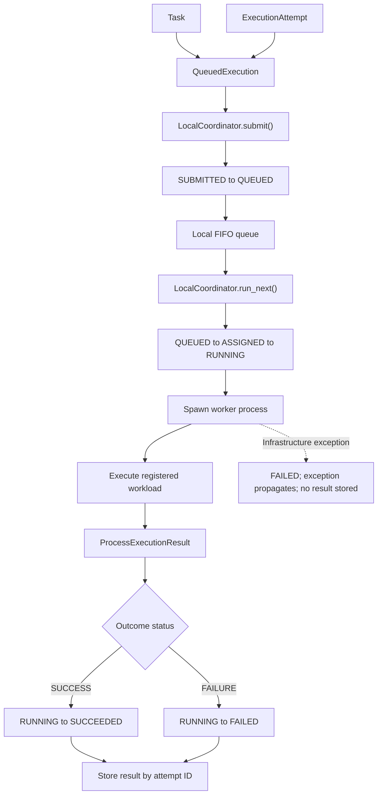

# Eve

A distributed batch-computing system for trusted local networks.

Imagine you need to run 5,000 independent simulations for a research project.
Your main computer could process them one at a time, but your laptop and another
desktop on the same network are sitting idle. Eve aims to divide that batch into
independent tasks, send each task to a suitable trusted device, collect the
results, and show whether distributing the work actually saved time.

Eve v0.1A does not distribute work between devices yet. It establishes the
local task, queue, state, process-execution, and result-handling foundations
required to build that system reliably.

## Project status

Eve v0.1A currently provides:

- Immutable `Task`, `Job`, `ExecutionAttempt`, and outcome models
- Validation for identifiers, model fields, and outcome combinations
- A deterministic FIFO local execution queue
- A state machine with validated execution transitions
- An allowlist of registered workloads
- Execution across Python's spawned process boundary
- Structured workload failures and propagated infrastructure failures
- A sequential `LocalCoordinator` that runs one queued execution at a time
- Unit and integration tests for the implemented behavior

This project is currently a foundation release, not a production-ready distributed system.

## Core concepts

| Concept | Purpose |
|---|---|
| `Job` | An immutable collection of related tasks under one `job_id`. Jobs are modeled but are not yet submitted to the coordinator as complete batches. |
| `Task` | One logical unit of work, identified by a `task_id`, workload name, and payload. |
| `ExecutionAttempt` | One specific try at executing a task. Future retries can create new attempts without changing the logical task. |
| `QueuedExecution` | An immutable pairing of a `Task` and `ExecutionAttempt`. Their `task_id` values must match. |
| `ExecutionState` | The lifecycle state of an attempt, such as `QUEUED`, `RUNNING`, `SUCCEEDED`, or `FAILED`. |
| `TaskOutcome` | A successful returned value or a structured workload error. A successful value may be `None`. |
| `ProcessExecutionResult` | The attempt ID, worker process ID, and task outcome returned across the process boundary. |
| `LocalCoordinator` | Owns the local queue, attempt states, and returned process results. |

## Current execution flow

The caller currently creates the task and its attempt explicitly. The
coordinator does not yet create attempts from an entire `Job`.



The two failure boundaries are intentionally different:

- A **workload failure** means the worker ran and returned a
  `ProcessExecutionResult` containing a failed `TaskOutcome`. The coordinator
  records `FAILED` and stores that result.
- An **infrastructure failure** means process execution raised before returning
  a result. The coordinator records `FAILED`, propagates the exception, and
  stores no result.

## Supported workloads

Workloads are selected by name from an internal allowlist. Eve does not use
`eval` or interpret a task's workload string as Python code.

| Workload | Payload | Behavior |
|---|---|---|
| `echo` | Any supported payload, including `None` | Returns the payload unchanged. |
| `sum-range` | A dictionary containing integer `start` and `stop` values | Sums the start-inclusive, stop-exclusive integer range. |

For example, `{"start": 1, "stop": 10}` produces `45`.

## Installation

### Windows PowerShell

Eve requires Python 3.14 or newer.

```powershell
git clone https://github.com/AryanArya11/eve.git
cd eve
py -3.14 -m venv venv
.\venv\Scripts\Activate.ps1
python -m pip install -e ".[dev]"
```

### Linux and macOS

```bash
git clone https://github.com/AryanArya11/eve.git
cd eve
python3.14 -m venv venv
source venv/bin/activate
python -m pip install -e ".[dev]"
```

## Basic usage

The current coordinator accepts individual `QueuedExecution` objects:

```python
from eve import ExecutionAttempt, LocalCoordinator, QueuedExecution, Task


def main() -> None:
    task = Task(
        task_id="task-001",
        workload="echo",
        payload={"message": "hello from Eve"},
    )

    attempt = ExecutionAttempt(
        attempt_id="attempt-001",
        task_id=task.task_id,
        attempt_number=1,
    )

    execution = QueuedExecution(
        task=task,
        attempt=attempt,
    )

    coordinator = LocalCoordinator()
    coordinator.submit(execution)

    result = coordinator.run_next()

    print(result.outcome.status.value)
    print(result.outcome.value)
    print(result.worker_pid)
    print(coordinator.state_for(attempt.attempt_id).value)


if __name__ == "__main__":
    main()
```

The `if __name__ == "__main__"` guard is required for safe use of Python's
spawned multiprocessing behavior, particularly on Windows.

## Project structure

```text
eve/
├── src/eve/
│   ├── __init__.py          # Public package interface
│   ├── task.py              # Logical task model
│   ├── job.py               # Related task collection
│   ├── attempt.py           # Per-task execution attempt
│   ├── outcome.py           # Structured success and failure outcomes
│   ├── state.py             # States and legal transitions
│   ├── local_queue.py       # FIFO queue and queued-execution pairing
│   ├── workloads.py         # Registered workload handlers
│   ├── worker.py            # Workload-to-outcome conversion
│   ├── process_executor.py  # Spawned process boundary
│   └── coordinator.py       # Local queue and execution coordination
├── tests/                    # Unit and integration tests
├── docs/                     # Per-component design notes
├── pyproject.toml
└── LICENSE
```

More detailed component contracts are documented in [`docs/`](docs/).

## Testing

Install the development dependencies and run the complete suite:

```powershell
python -m pytest
```

The tests cover model validation, immutability, serialization, queue ordering,
duplicate handling, state transitions, workload outcomes, spawned process
execution, coordinator behavior, infrastructure failures, and the public
package interface.

## Current limitations

Eve v0.1A intentionally does not provide:

- Networking, discovery, or remote workers
- Complete `Job` submission or batch result aggregation
- A reusable multi-worker process pool
- Automatic retries or retry policy
- Coordinator cancellation behavior
- Timing metrics or a benchmark harness
- Persistent state or results
- GPU, NPU, or other accelerator backends
- Concurrent coordinator calls from multiple threads
- A sandbox for executing untrusted code or deserializing untrusted data

The current design assumes trusted code and data. Registered workload names
reduce accidental arbitrary function selection, but the separate worker process
is not a security boundary for hostile input.

## Roadmap

- **v0.1B:** local batch execution, worker reuse, result aggregation, timing
  measurements, and honest sequential-versus-multiprocessing benchmarks
- **v0.2:** a reproducible two-computer CPU cluster on a trusted local network
- **v0.3:** worker discovery, capability inventory, health reporting, and
  benchmark-informed scheduling
- **Later:** one evidence-driven accelerator backend, Android exploration,
  shared local inference, and extension interfaces informed by real backends

## License

Eve is licensed under the [Apache License 2.0](LICENSE).
